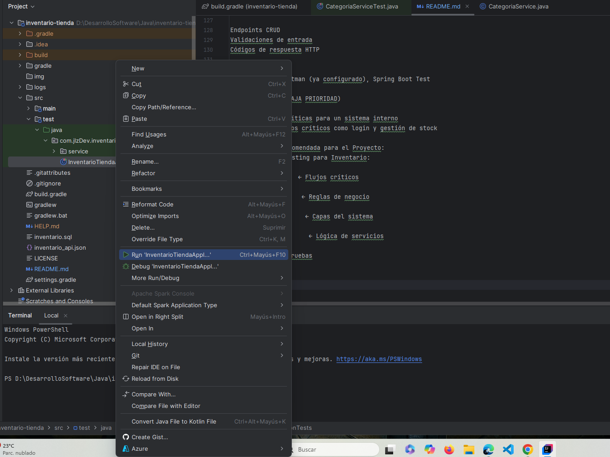
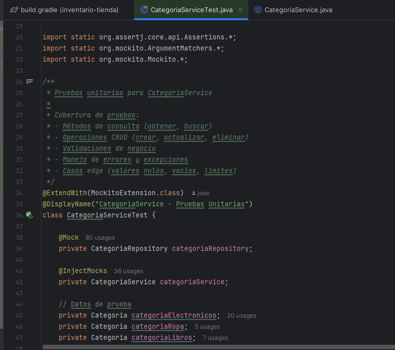
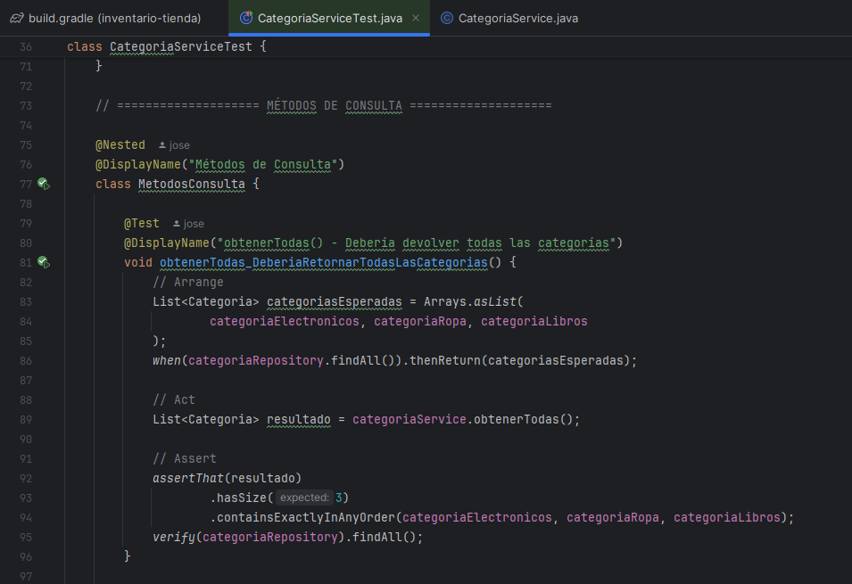
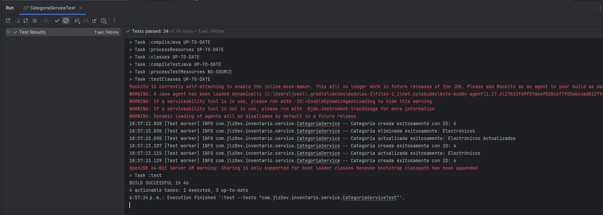

# inventario-tienda
Api backend para control de inventarios

● ¿Qué tipos de pruebas de software existen? Explique sus características y beneficios.
1. Pruebas Unitarias
   Características:

Prueban métodos y funciones individuales de forma aislada
Son de bajo nivel, cercanas al código fuente
Se ejecutan rápidamente y son baratas de automatizar AWSAtlassian

Beneficios:

Detección temprana de errores
Facilitan el debugging
Son la primera línea de defensa
Soportan refactoring seguro

2. Pruebas de Integración
   Características:

Evalúan cómo interactúan varios módulos entre sí
Se ejecutan después de las pruebas unitarias
Pueden ser incrementales (Top-down, Bottom-up) o Big Bang QalifiedTMMI

Beneficios:

Detectan problemas de comunicación entre módulos
Verifican el flujo de datos entre componentes
Identifican errores de integración tempranamente

3. Pruebas Funcionales
   Características:

Se centran en los requisitos de negocio
Verifican la salida sin importar estados intermedios
Prueban funcionalidades completas del sistema AtlassianProgramación y más

Beneficios:

Aseguran cumplimiento de requerimientos
Validan la experiencia del usuario
Garantizan funcionalidad esperada

4. Pruebas End-to-End (E2E)
   Características:

Prueban todo el sistema desde la interfaz hasta la base de datos
Simulan el comportamiento real del usuario
Son más costosas de implementar y mantener ▷ Tipos de Pruebas de Software: Unitarios vs. Integración vs. End-to-End

Beneficios:

Cobertura completa del sistema
Detectan errores complejos
Aumentan confianza en el software

5. Pruebas de Rendimiento
   Características:

Verifican rendimiento contra puntos de referencia
Evalúan velocidad, escalabilidad y recursos
Incluyen pruebas de carga y estrés Tipos de pruebas de software: diferencias y ejemplos - LoadView

Beneficios:

Identifican cuellos de botella
Optimizan el sistema
Garantizan escalabilidad

6. Pruebas de Aceptación
   Características:

Verifican que el sistema satisface requisitos de negocio
Requieren que toda la aplicación esté funcionando
Se centran en replicar comportamiento de usuarios AtlassianProgramación y más

Beneficios:

Validación final antes del despliegue
Confirman satisfacción de stakeholders
Aseguran cumplimiento de criterios de aceptación

● Según la consulta, ¿qué tipos de pruebas se adaptan mejor al proyecto de inventario que está desarrollando?
Basándome en las características del proyecto de Sistema de Inventario para Tienda con arquitectura en capas, recomiendo esta estrategia de testing:
🎯 Pruebas Recomendadas (en orden de prioridad):
1. Pruebas Unitarias (ALTA PRIORIDAD)

Por qué: Perfect para arquitectura en capas
Dónde aplicar:

Service Layer: CategoriaService, ProductoService, UsuarioService
Validaciones de negocio
Métodos de utilidad

Herramientas: JUnit 5 + Mockito (ya configuradas)

2. Pruebas de Integración (ALTA PRIORIDAD)

Por qué: Críticas para validar interacciones entre capas
Dónde aplicar:

Repository ↔ Database
Service ↔ Repository
Controller ↔ Service

Herramientas: Spring Boot Test con @DataJpaTest, @WebMvcTest

3. Pruebas Funcionales (MEDIA PRIORIDAD)

Por qué: Validan reglas de negocio del inventario
Dónde aplicar:

CRUD completo de categorías/productos
Gestión de stock y movimientos
Autenticación JWT

Herramientas: TestRestTemplate, MockMvc

4. Pruebas de API (MEDIA PRIORIDAD)

Por qué: Sistema REST API requiere validación de endpoints
Dónde aplicar:

Endpoints CRUD
Validaciones de entrada
Códigos de respuesta HTTP

Herramientas: Postman (ya configurado), Spring Boot Test

5. Pruebas E2E (BAJA PRIORIDAD)

Por qué: Menos críticas para un sistema interno
Cuándo: Solo flujos críticos como login y gestión de stock

📊 Estrategia Recomendada para el Proyecto:
🔺 Pirámide de Testing para Inventario:

E2E (5%)           ← Flujos críticos
─────────
Funcionales (15%)   ← Reglas de negocio
───────────────
Integración (25%)    ← Capas del sistema
─────────────────
Unitarias (55%)       ← Lógica de servicios

## Ejecución de pruebas

1. Correr el test

2. Set de pruebas

3. Pruebas por Objetivos

4. Resultados

